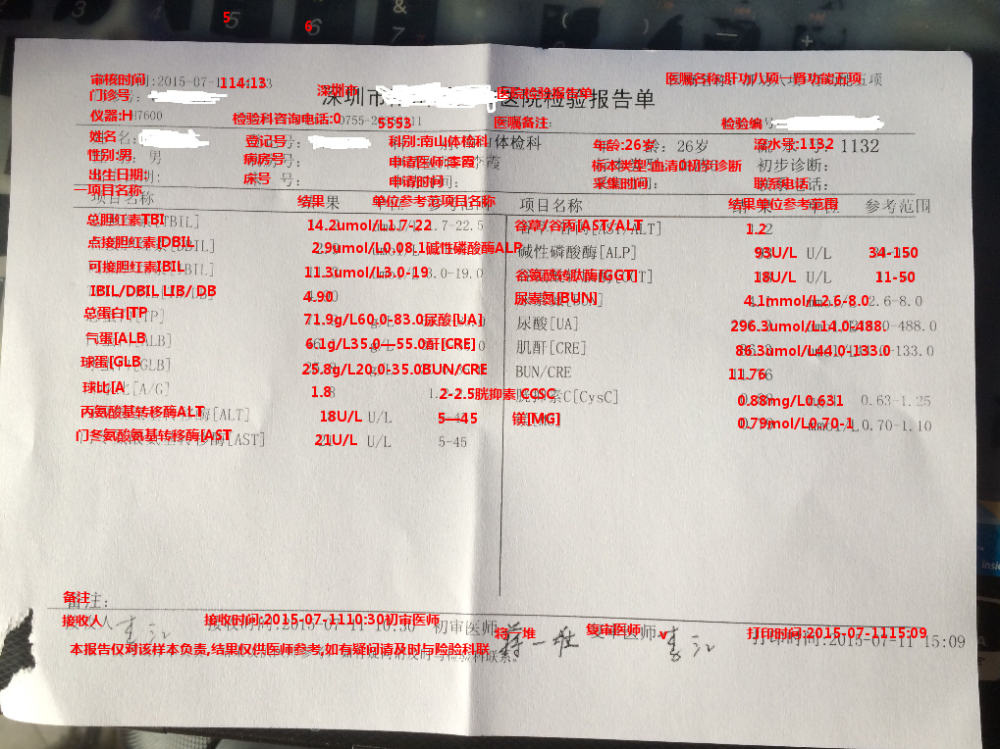

# Checkup - Project Log

## [05.07] Project starts today!
 - [DONE] Creat a __crawler__ to get multiple imgs by key word '`体检单`' in [Baidu Image](https://image.baidu.com/).
 - [DONE] Add filter to my crawler to ignore _low resolution pics_ & _expired urls_ .
 - [DONE] Using [Baidu OCR](https://ai.baidu.com/) to recognize texts in images.
 - [to-do] Optimize OCR procedure with [`multiprocessing`](https://docs.python.org/3.6/library/multiprocessing.html) library.
 - [to-do] Correct the direction of downloaded image, reproduced the font size according to [Baidu OCR](https://ai.baidu.com/) api response.

 {:width="200px"}

---

## [05.08] Code review & Optimization
 - [DONE] Extend my __crawler__ to support multiple key words, and test it to download larger amount of pictures (`627` valid / `2300` in total).
 - [DONE] Add `isDownloaded` check to my crawler to skip downloaded pictures.
 - [DONE] Optimize OCR procedure with [`multiprocessing`](https://docs.python.org/3.6/library/multiprocessing.html) library.
 - [to-do] (More TODOs coming up...)
