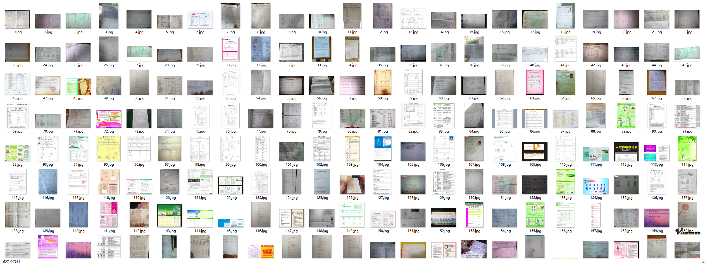
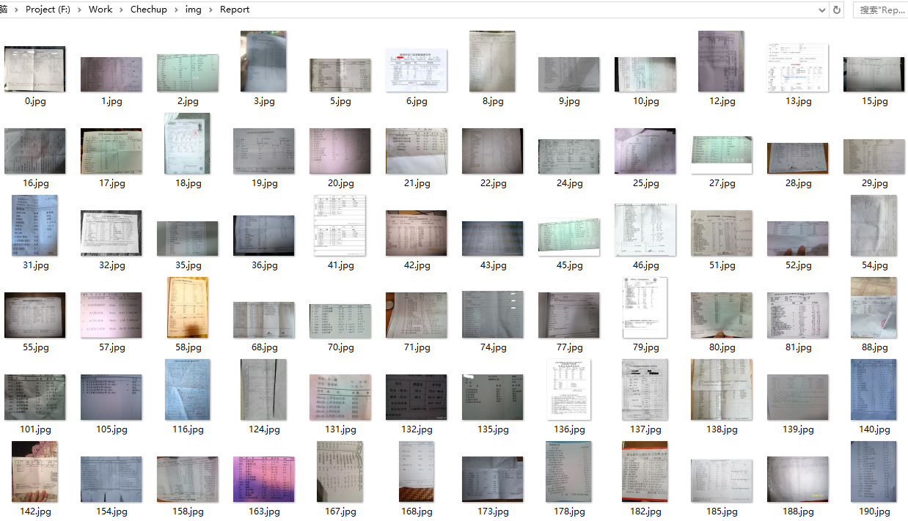
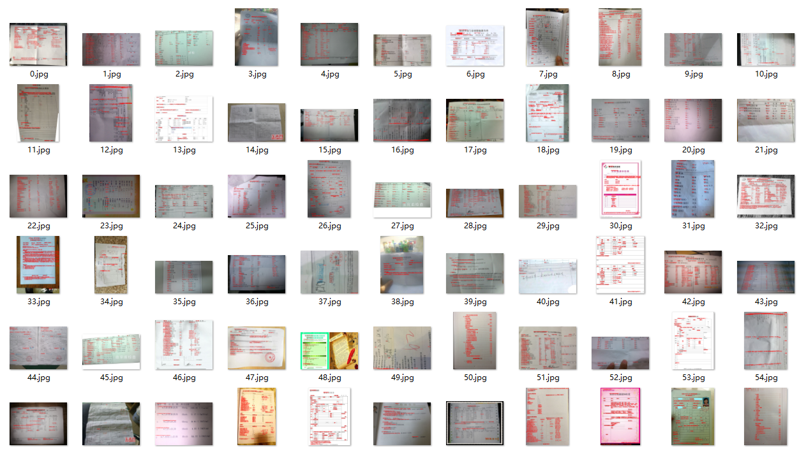
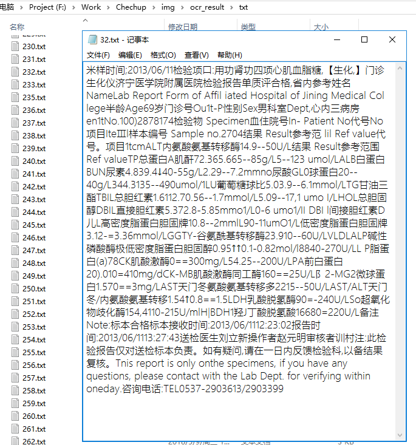
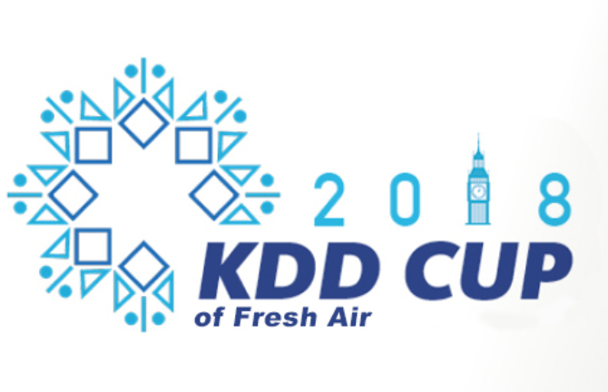
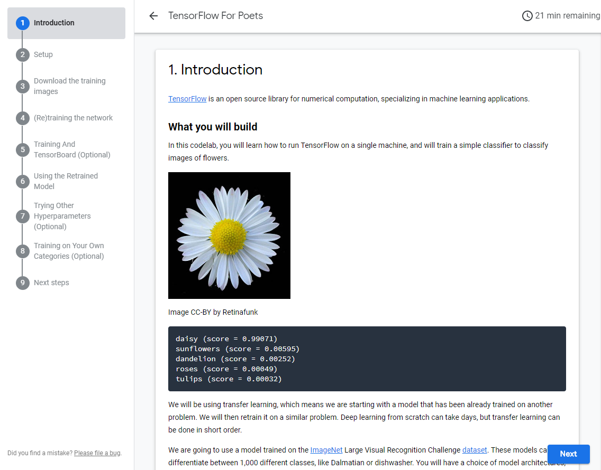

# Checkup - Project Log

## [05.07] Project starts today!
 - __[DONE]__ Creat a __crawler__ to get multiple imgs by key word '`体检单`' in [Baidu Image](https://image.baidu.com/).
 - __[DONE]__ Add filter to my crawler to ignore _low resolution pics_ & _expired urls_ .
 - __[DONE]__ Using [Baidu OCR](https://ai.baidu.com/) to recognize texts in images.
 - _[to-do]_ Optimize OCR procedure with [`multiprocessing`](https://docs.python.org/3.6/library/multiprocessing.html) library.
 - _[to-do]_ Correct the direction of downloaded image, reproduced the font size according to [Baidu OCR](https://ai.baidu.com/) api response.

---

## [05.08] Code review & Optimization
 - __[DONE]__ Extend my __crawler__ to support multiple key words, and test it to download larger amount of pictures (`627` valid / `2300` in total).
 - __[DONE]__ Add `isDownloaded` check to my crawler to skip downloaded pictures.
 - __[DONE]__ Speed up OCR procedure with [`multiprocessing`](https://docs.python.org/3.6/library/multiprocessing.html) library.
 - _[to-do]_ Correct the direction & lightness of images for model training later.
 

 
 ---
 
 ## [05.09] Data cleaning and tagging
 - _[to-do]_ Manually orting download images into two class of _report_ (218/627) or _notReport_ (409/627).
 - __[DONE]__ Learn basics about __image classifier__ with Tensorflow. Some materials are listed below:
   - [TensorFlow Tutorial 2: Image Classification Walk-through](https://www.youtube.com/watch?v=oXpsAiSajE0)
   - [Train an Image Classifier with TensorFlow for Poets - Machine Learning Recipes #6](https://www.youtube.com/watch?v=cSKfRcEDGUs)
   - [Easy Image Classification with Tensorflow](https://www.youtube.com/watch?v=qaQofXTxkSo)
   - [Build a TensorFlow Image Classifier in 5 Min](https://www.youtube.com/watch?v=QfNvhPx5Px8)
 - _[to-do]_ Extract words from '_report_' images and find some pattern (IDEA! The _is_Report_ detection can use both image classifier & context classifier).
 - _[to-do]_ Use [opencv-python](https://pypi.org/project/opencv-python/) library and [Baidu OCR](https://ai.baidu.com/) to optimize image (lightness / direction / contrast / white balance).
 - [FAIL] Multiprocess dead with no reason, DISABLE multiprocess functionality.

 
---

## [05.10-05.12] Batching OCR / Text extracting
 - __[DONE]__ OCR every image, save synthetic image for future debuging, save image for text classification.
 - _[to-do]_ How to isolate our interested area and auto-correct incorrect character in OCR result?

---

## [05.11-05.12] (Progress stagnated)
 - Perparing for [_China College Students' Enterpreneurship Competition 2018_](http://www.chuangqingchun.net/)
 - Coding for [_KDD CUP 2018_](https://biendata.com/competition/kdd_2018/)

---

## [05.13] Model choosing for image classification
 - __[DONE]__ Choose [Tensorflow for Poets](https://codelabs.developers.google.com/codelabs/tensorflow-for-poets/#0) for __Image Classification__
 - __[DONE]__ Decided to use both image classification and text classification to distinguish whether a target image is a checkup report or not.
 - _[to-do]_ Choose a text classfier
 - _[to-do]_ Deciede how much categories should there be to improve classification result. (`is_report`/`paper_but_not_report`/`not_paper`)

