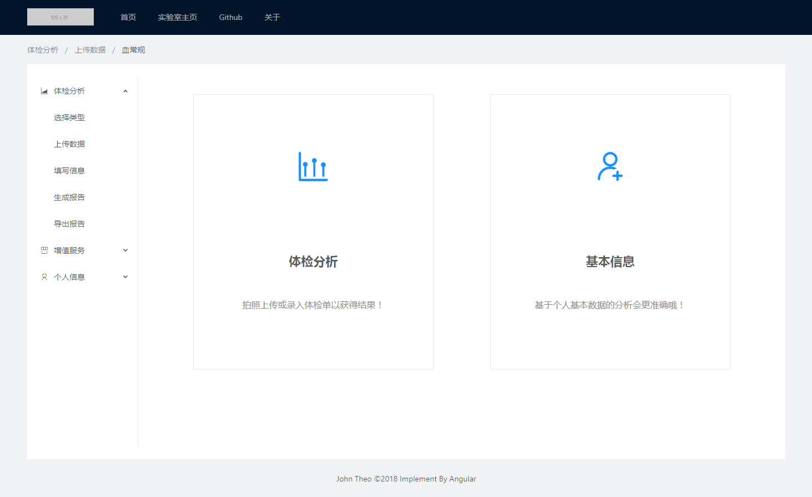
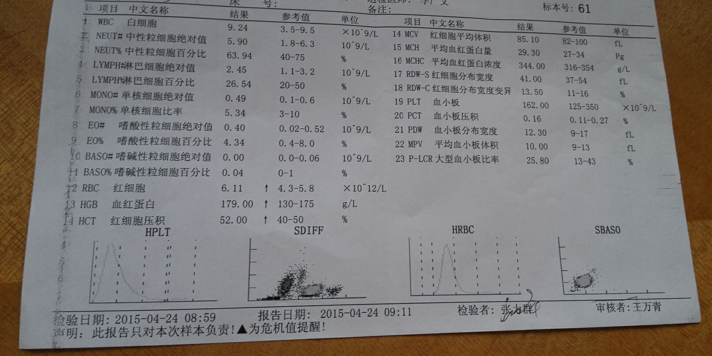
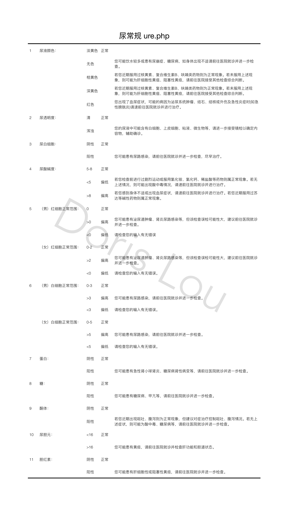

# Checkup - Project Log

## [05.07] Project starts today!
 - __[DONE]__ Creat a __crawler__ to get multiple imgs by key word '`体检单`' in [Baidu Image](https://image.baidu.com/).
 - __[DONE]__ Add filter to my crawler to ignore _low resolution pics_ & _expired urls_ .
 - __[DONE]__ Using [Baidu OCR](https://ai.baidu.com/) to recognize texts in images.
 - _[to-do]_ Optimize OCR procedure with [`multiprocessing`](https://docs.python.org/3.6/library/multiprocessing.html) library.
 - _[to-do]_ Correct the direction of downloaded image, reproduced the font size according to [Baidu OCR](https://ai.baidu.com/) api response.

---

## [05.08] Code review & Optimization
 - __[DONE]__ Extend my __crawler__ to support multiple key words, and test it to download larger amount of pictures (`627` valid / `2300` in total).
 - __[DONE]__ Add `isDownloaded` check to my crawler to skip downloaded pictures.
 - __[DONE]__ Speed up OCR procedure with [`multiprocessing`](https://docs.python.org/3.6/library/multiprocessing.html) library.
 - _[to-do]_ Correct the direction & lightness of images for model training later.
 

 
 ---
 
 ## [05.09] Data cleaning and tagging
 - _[to-do]_ Manually orting download images into two class of _report_ (218/627) or _notReport_ (409/627).
 - __[DONE]__ Learn basics about __image classifier__ with Tensorflow. Some materials are listed below:
   - [TensorFlow Tutorial 2: Image Classification Walk-through](https://www.youtube.com/watch?v=oXpsAiSajE0)
   - [Train an Image Classifier with TensorFlow for Poets - Machine Learning Recipes #6](https://www.youtube.com/watch?v=cSKfRcEDGUs)
   - [Easy Image Classification with Tensorflow](https://www.youtube.com/watch?v=qaQofXTxkSo)
   - [Build a TensorFlow Image Classifier in 5 Min](https://www.youtube.com/watch?v=QfNvhPx5Px8)
 - _[to-do]_ Extract words from '_report_' images and find some pattern (IDEA! The _is_Report_ detection can use both image classifier & context classifier).
 - _[to-do]_ Use [opencv-python](https://pypi.org/project/opencv-python/) library and [Baidu OCR](https://ai.baidu.com/) to optimize image (lightness / direction / contrast / white balance).
 - [FAIL] Multiprocess dead with no reason, DISABLE multiprocess functionality.

 
---

## [05.10-05.12] Batching OCR / Text extracting
 - __[DONE]__ OCR every image, save synthetic image for future debuging, save image for text classification.
 - _[to-do]_ How to isolate our interested area and auto-correct incorrect character in OCR result?

---

## [05.11-05.12] (Progress stagnated)
 - Perparing for [_China College Students' Enterpreneurship Competition 2018_](http://www.chuangqingchun.net/)
 - Coding for [_KDD CUP 2018_](https://biendata.com/competition/kdd_2018/)

---

## [05.13] Model choosing for image classification
 - __[DONE]__ Choose [Tensorflow for Poets](https://codelabs.developers.google.com/codelabs/tensorflow-for-poets/#0) for __Image Classification__
 - __[DONE]__ Decided to use both image classification and text classification to distinguish whether a target image is a checkup report or not.
 - _[to-do]_ Choose a text classfier
 - _[to-do]_ Deciede how much categories should there be to improve classification result. (`is_report`/`paper_but_not_report`/`not_paper`)

---

## [05.14-05.17] Image classifier Implementation
 - __[DONE]__ Image classifier implementation(test acuuracy above 90%).
 - __[DONE]__ Choose [__Naive Bayes__](https://en.wikipedia.org/wiki/Naive_Bayes_classifier) for my text classifierer.
 - _[to-do]_ Text classifier
 - _[to-do]_ GUI
 

 
---

## [05.18-05.19] (Progress stagnated)
 - Perparing for [_China College Students' Enterpreneurship Competition 2018_](http://www.chuangqingchun.net/)
 - Coding for [_KDD CUP 2018_](https://biendata.com/competition/kdd_2018/)

---

## [05.20] Naive Bayes Implementation and Optimization
 - __[DONE]__ Complete text classification

## [05.21] Classifier Integration
 - __[DONE]__ Get prediction result from both image classifier & text classifier.
 - _[to-do]_ Using [__Decision Tree__](https://en.wikipedia.org/wiki/Decision_tree) to make the final call.

---

## [05.21-05.28] Front-end Development
 - __[DONE]__ Choose [`Angular`](https://angular.cn/) as front-end framework.
 - __[DONE]__ Complete several pages & routing.
 - __[DONE]__ Add logo for our project.
 - __[DONE]__ [Another project](https://box.zjuqsc.com/-zxhbb6).
 - _[to-do]_ Complete visualization.
 - _[to-do]_ Complete back-end.
 - _[to-do]_ Info extraction.
 - _[to-do]_ Decision tree.

## [05.29] Database Establishment
 - __[DONE]__ Choose sqlite3 as the database for the project.
 - __[DONE]__ Increase image number to get more data.
   - Search by key word '`随机`';
   
   - Search by key word '`纸头`';
   - Search by key word '`作业`';
   - Search by key word '`作文 草稿`';
   
 - __[DONE]__ Standardize classification result, and storage in database.
 
 
 - __[DONE]__ No-text-in-picture warning.
 
 - _[to-do]_ Model integration & batch prediction.
 - _[to-do]_ Infomation digging from examination reports.

## [05.30] Model Integration with Decision Tree
 - __[DONE]__ Implement K Means.
 - __[DONE]__ Exploring best iteration rounds for K means(K=3): 
   - __Results are identical when max_iter>100__.
   
 - __[DONE]__ Focusing on accuracy of category '`report`'.
 - __[DONE]__ Exploring what cause the classification failure: 
   - __Failure of image classification, but luckily, text classification seem right__.
   
 - __[DONE]__ ADD FEATURE: Are two methods making the same conclusion? Yes->1.0; No->0.0.
 - __[DONE]__ Parameter tuning. Best being 90.1% correct(_That's not good_).
   
 - __[DONE]__ DELETE FEATURE: Identical conclusion.
 - __[DONE]__ Exploring features: `subtraction`, `deviding`, `single`, `both`...
 - __[DONE]__ ADD FEATURE: `TXT_report` - `TXT_pnr`.
 - __[DONE]__ Parameter tuning. Best being 94.9% correct(_That's really good_).
   
   
 - __[DONE]__ Try K means(K=2): 
   - __Model improved significantly!!!__
   
 - __[DONE]__ Add more data.
 - __[DONE]__ Correct denominator.
   
 - __[DONE]__ Implement Decision Tree.
 - __[DONE]__ Batch test, and get thrilling results(Screenshot hasn't shown the best result).
   
 - __[DONE]__ Visualizing my decision tree.
   
 - __[DONE]__ Batch test with traning data: 
   - __Results even better: Outliers exist!__
   - 
 - __[DONE]__ Test integrated model on never-seen data.
   
 - _[to-do]_ Infomation digging from examination reports.
 - _[to-do]_ System back-end.

## [05.31] (Progress stagnated)
 - Some paper work.

## [06.01] Infomation Extraction

 - A success.
   - 
 - Partial failure due to distortion.
   - Information "Not found" but exist.
     - 
     - 
   - Wrong content order because of image skew.
     - 
 - Calibration.
   - Edge detection.
     - 
   - Line detection (`max_contour_length` + `max_width` + `height` + `position`).
     - 
   - End point adjusting.
     - 
   - Wrapping.
     - 
 - Different pattern & expression brings new challenge.
   - 
 - _[to-do]_ Report logic & visualization.
 - _[to-do]_ Back-end construction.
 - _[to-do]_ System integration.
 - _[to-do]_ Production environment deployment.

## [06.02] Report Logic Determination

## [06.03] Full Report UI Design

## [06.04] Front-end Completion & Back-end Construstion
 - _[to-do]_ Interactive front-end completion with Angular.
 - _[to-do]_ Use [Node.js](https://nodejs.org/) to build a server.
 - _[DONE]_ Choose [MongoDB](https://www.mongodb.com/) as a database (Store user info & uploaded data).
 - _[DONE]_ Choose [ReportLab](https://www.reportlab.com/) to generate report with structured data.
