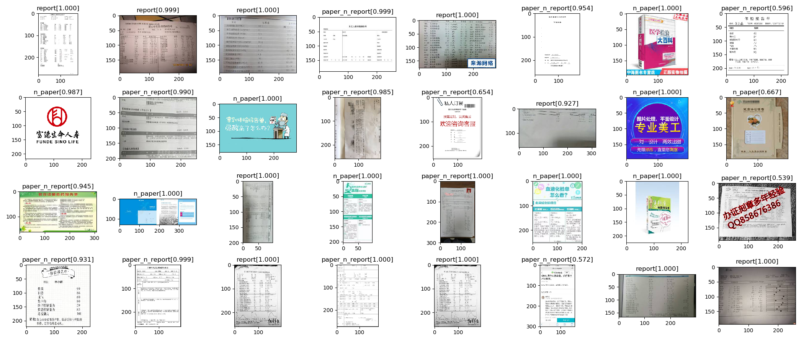

# 体检报告单自动分析系统

本项目期望通过用户上传的体检报告单，结合用户的自身状况，语义化地将报告结果呈现给用户。

## 功能需求概览

| 需求               | 是否与机器学习相关 | 方案替代     | 优先级 |
| ------------------ | ------------------ | ------------ | ------ |
| 用户上传图片并OCR  | 是                 | /            | 高     |
| 用户图片合法性验证 | 是                 | /            | 低     |
| OCR结果信息提取    | 否                 | 用户手动填写 | 中     |
| 数据转语义         | 是                 | 基于既定规则 | 中     |
| 数据可视化         | 否                 | /            | 高     |
| PDF生成            | 否                 | /            | 高     |
| 数据沉淀和跟踪     | 否                 | /            | 中     |

## 项目技术选型

- **GUI。**基于 `Angular 2+`，采用 `Ant Design` 组件库。

- **后端、服务。**基于 `Node.js`、`Express`，需要进行复杂操作的步骤（如生成PDF等）均调用 `Python` 脚本实现。

- **数据库。**网页应用数据库采用 `MongoDB`，训练结果存储采用 `Sqlite3`。

- **OCR。**使用 `Baidu OCR API`。使用含位置信息的文本识别，预期位置信息能帮助信息提取，但是发现因为识别结果非常混乱，实现难度相当之大。

- **OCR信息提取。**`OpenCV` 区域划分，基于自定义打分矩阵的文本模糊匹配。

- **PDF生成。**使用 `Report Lab`。图片和文字分层渲染，图片自适应布局，全局统一坐标系。

- **图片合法性验证。** 图像和文字两种分类器的整合。图像分类器采用 `TensorFlow for Poets` 迁移学习，文字分类器采用朴素贝叶斯，模型集合采用决策树（对两个分类器六个概率值）。

## 项目经历

### 用户图片合法性验证

本模块通过决策树对图形分类器和文字分类器的6个概率值进行学习，判断用户上传的图片是否是体检单照片（并没有什么用，拿来入门练个手TAT）。

#### 数据采集与清洗

- 采用爬虫下载了众多“体检单”等关键词的图片。
- 增加尺寸过滤器。
- 因为图片重复较多，增加“isDownloaded”过滤器。
- 开启多进程。因为进程异常挂起放弃多线程。
- 使用百度OCR SDK获得结果，并绘制到原图上检验。
- 人工分类（体检报告单，纸张但不是体检报告单，不是纸张）并删除无关数据。

#### 图形分类器

 - TensorFlow for Poets 迁移学习。
 - 正确率 90.1 %（但是数据集太小了）。

#### 文字分类器

 - 使用 `collections.Counter` 进行字频统计，发现效果并不良好。
 - 统计并过滤了没有类别特异性的词汇（如“1”，“的”）。
 - 模型对于“报告”和“非纸质材料”两类判别正确率9
