# 体检报告单自动分析系统

本项目期望通过用户上传的体检报告单，结合用户的自身状况，语义化地将报告结果呈现给用户。

本项目 *关键代码*  已经在 github 上全部开源 [[传送门](https://github.com/John-Theo/Checkups/tree/master/Key%20Codes)]。


## 一、功能需求概览

| 需求               | 是否与机器学习相关 | 方案替代     | 优先级 |
| ------------------ | ------------------ | ------------ | ------ |
| 用户上传图片并OCR  | 是                 | /            | 高     |
| 用户图片合法性验证 | 是                 | /            | 低     |
| OCR结果信息提取    | 否                 | 用户手动填写 | 中     |
| 数据转语义         | 是                 | 基于既定规则 | 中     |
| 数据可视化         | 否                 | /            | 高     |
| PDF生成            | 否                 | /            | 高     |
| 数据沉淀和跟踪     | 否                 | /            | 中     |


## 二、项目技术选型

- **GUI。**基于 `Angular 2+`，采用 `Ant Design` 组件库。
- **GUI。** 基于 `Angular 2+`，采用 `Ant Design` 组件库。
- **后端、服务。** 基于 `Node.js`、`Express`，需要进行复杂操作的步骤（如生成PDF等）均调用 `Python` 脚本实现。
- **数据库。 **网页应用数据库采用 `MongoDB`，训练结果存储采用 `Sqlite3`。
- **OCR。** 使用 `Baidu OCR API`。使用含位置信息的文本识别，预期位置信息能帮助信息提取，但是发现因为识别结果非常混乱，实现难度相当之大。
- **OCR信息提取。** `OpenCV` 区域划分，基于自定义打分矩阵的文本模糊匹配。
- **PDF生成。 **使用 `Report Lab`。图片和文字分层渲染，图片自适应布局，全局统一坐标系。
- **图片合法性验证。**  图像和文字两种分类器的整合。图像分类器采用 `TensorFlow for Poets` 迁移学习，文字分类器采用朴素贝叶斯，模型集合采用决策树（对两个分类器六个概率值）。


## 三、项目经历


### 1. 用户图片合法性验证

本模块通过决策树对图形分类器和文字分类器的6个概率值进行学习，判断用户上传的图片是否是体检单照片（并没有什么用，拿来入门练个手TAT）。


#### 1） 数据采集与清洗

- 采用爬虫下载了众多“体检单”等关键词的图片。
- 增加尺寸过滤器。
- 因为图片重复较多，增加“isDownloaded”过滤器。
- 开启多进程。因为进程异常挂起放弃多线程。
- 使用百度OCR SDK获得结果，并绘制到原图上检验。
- 人工分类（体检报告单，纸张但不是体检报告单，不是纸张）并删除无关数据。


**图片爬虫：** （关键代码）

```python
import re
import requests
import time
from urllib import parse

TOTAL_PIC_NUM = 600
IMG_START_INDEX = 785
KEY_WORD = '作文 草稿'
PIC_ROOT = '../img/add/'

i = IMG_START_INDEX
processed = 0
downloaded = []

# 分页爬取图片
for pn in range(0, TOTAL_PIC_NUM, 20):
    word = parse.quote(KEY_WORD)
    url = 'http://image.baidu.com/search/flip?tn=baiduimage&word='+word+'&pn=' + str(pn)
    html = requests.get(url).text
    pic_url = re.findall('"objURL":"(.*?)",', html, re.S)

    for each in pic_url:
        processed += 1
        # 曾经下载跳过
        if each in downloaded:
            print('[Alert] Previous downloaded!')
            continue
        try:
            pic = requests.get(each, timeout=10)
            try:
                print('[%d/%d/%d]' % (i, processed, TOTAL_PIC_NUM*3), pic.headers['Content-Length'])
                # 分辨率太小跳过
                if int(pic.headers['Content-Length']) < 50000:
                    print('[Alert] Pic too small!')
                    continue
            except KeyError:
                print('[Alert] Pic size unknown!')
                continue
        # URL过期跳过
        except:
            print('[Error] Url expired!')
            continue
        string = PIC_ROOT + str(i) + '.jpg'
        # 保存图片
        fp = open(string, 'wb')
        fp.write(pic.content)
        fp.close()
        downloaded.append(each)
        i += 1
```


**封装图片识别类：** （关键代码）

```python
from aip import AipOcr
from src.grapher import ocr
from multiprocessing import Pool, freeze_support, Queue
from src.perspective_correction import wrap
import cv2
from time import time
import os

class Img2Txt:
    def __init__(self, txt_folder='../img/ocr_result/txt/', img_folder='../img/original/', if_ocr=True):
        self.txt_folder = txt_folder
        self.img_folder = img_folder
        self.if_ocr = if_ocr

    def do_ocr(self, img, opt, fn, mode):
        def get_client():
            APP_ID = '我的 APP_ID'
            API_KEY = '我的 API_KEY'
            SECRET_KEY = '我的 SECRET_KEY'

            cnt = AipOcr(APP_ID, API_KEY, SECRET_KEY)
            return cnt

        start = time()
        print('[ → ]', fn, 'started...')
        """ 带参数调用通用文字识别（含位置高精度版） """
        client = get_client()
        result = client.general(img, opt)
        print('\t', str(result)[:140]+'...')

        """ 识别结果返回json梳理 """
        list_t = []
        word_list = []
        for item in result['words_result']:
            pos = item['vertexes_location'][0]
            word = item['words']
            list_t.append((word, (pos['x'], pos['y'])))
            word_list.append(word)

        if self.if_ocr:
            ocr(list_t, fn, start, mode=mode)
        with open(self.txt_folder + fn[:-4] + '.txt', 'w') as f:
            if mode == 'full_info':
                f.write(str(list_t))
            else:
                f.write(''.join(word_list))

    """ 过大的图片需要先缩放到合适大小 """
    def img2txt(self, mode, filename=''):
        def img_size_regulizer(fn):
            img = cv2.imread(self.img_folder + 'wrapped/' + fn)
            if (img.shape[0] > 3000) or (img.shape[1] > 3000):
                print('[ . ] Adjusting size for %s ...' % fn)
                scale_x = img.shape[1] / 3000
                scale_y = img.shape[0] / 3000
                scale = max(scale_x, scale_y)
                img = cv2.resize(img, (int(img.shape[1] / scale), int(img.shape[0] / scale)))
                cv2.imwrite(self.img_folder + fn, img)
                print('[ - ] Adjust finished.')
            return get_file_content(self.img_folder + 'wrapped/' + fn)

        """ 可选参数 """
        options = {}
        options["recognize_granularity"] = "big"
        options["detect_direction"] = "true"
        options["vertexes_location"] = "true"
        options["probability"] = "true"

        print('[ . ] Wrapping for %s ...' % filename)
        warning = wrap(self.img_folder, filename)
        if warning == 'Warp fail':
            print('[ x ] Wrap failed, proceed on.')
        else:
            print('[ - ] Wrap finished.')

        try:
            image = img_size_regulizer(filename)
        except AttributeError:
            print('[ x ] Error in %s' % filename)
            return

        if not os.path.exists(self.txt_folder + filename[:-4] + '.txt'):
            self.do_ocr(image, options, filename, mode)
        else:
            print('[?]  %s already exists!' % (self.txt_folder + filename[:-4] + '.txt'))
```


#### 2）图形分类器

 - TensorFlow for Poets 迁移学习。
 - 正确率 90.1 %（但是数据集太小了）。


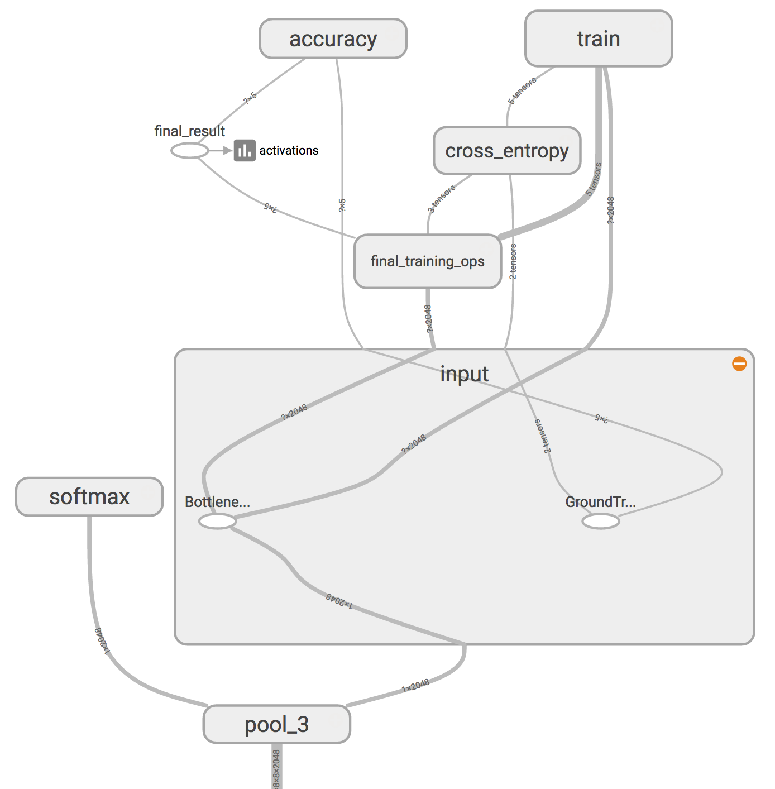


#### 3）文字分类器

 - 使用 `collections.Counter` 进行字频统计，发现效果并不良好。
 - 统计并过滤了没有类别特异性的词汇（如“1”，“的”）。
 - 模型对于“报告”和“非纸质材料”两类判别正确率90%左右，但对于“纸质但不是报告”的分类经常容易判别成“报告”。（事实上，我在“纸质但不是报告”类别中，放的大多数图片都是宣传体检的小广告，里面也有很多体检类目的术语）


**图片分类器：** （关键代码）

```python
import src.tf4poets2.scripts.label_image as li
import tensorflow as tf
import time
import numpy as np
import os
import matplotlib.pyplot as plt

class CalcResult:
    def __init__(self, dir_prefix=''):
        self.dir_prefix = dir_prefix
        self.graph = li.load_graph(dir_prefix+model_file)
        self.input_operation = self.graph.get_operation_by_name(input_name)
        self.output_operation = self.graph.get_operation_by_name(output_name)

    def classify_it(self, t, sess):
        result = sess.run(self.output_operation.outputs[0],
                          {self.input_operation.outputs[0]: t})
        return np.squeeze(result)

    def load_tensor(self, fn):
        print('loading %s...' % fn)
        tensor = li.read_tensor_from_image_file(fn,
                                                input_height=input_height,
                                                input_width=input_width,
                                                input_mean=input_mean,
                                                input_std=input_std)
        return tensor

    def meaning_result(self, m_results):
        m_top_k = m_results.argsort()[-5:][::-1]
        m_labels = li.load_labels(self.dir_prefix+label_file)
        return m_top_k, m_labels
```


#### 4）模型整合

 - 数据准备。
   - 降低图片分辨率喂给训练好的图像分类器，获得三类概率。
   - 原图上传 Baidu OCR，获得文字识别json文件。
   - 将json文件中的文字分离，喂给训练好的文字分类器，获得三类概率。
 - 将两个分类器的各3个预测概率写入 `sqlite3` 数据库中。
 - 尝试 K Means 聚类
   - 100轮迭代内聚类中心已经稳定，增加轮数结果完全相同。
   - 图像分类器和文字分类器具有很好的互补作用（典型的决策树问题）。
   - 一些文字分类器前两类结果太相近时不具有参考价值：增加新 feature，做差做商，结果发现单独做差效果更好。
   - 聚成2类（K=2）（实际问题中我不关注“纸张但不是报告”和“不是报告”的区别），效果进一步提升。
   - 至此正确率达到 87.9%（训练集上）。
 - 尝试决策树
   - 使用 scikit-learn 的 tree。
   - 自动训练和cross validation。训练集 99.8% 以上，测试集 89% 以上正确率。
   - 随机抽取100张图片测试，TP:FP:TN:FN = 38:0:61:1，理论正确率98%。


**K_Means实现：**（关键代码）

```python
import sqlite3
from sklearn.cluster import KMeans
from sklearn.externals import joblib
import numpy

conn = sqlite3.connect('../../db/classification.db')
c = conn.cursor()
c.execute("SELECT * FROM result")
all_records = c.fetchall()

""" 数据准备 """
data = []
report_num = 0
for record in all_records:
    if record[1] == 'report':
        report_num += 1
    data.append(list(record[3:])+[record[6]-record[7]])  # +[0.0 if record[6] == 0 else record[5]/record[6]]

max_iter = 100
print('\n\n[PARAMS] Max_iter = %d' % max_iter)

clf = KMeans(
    n_clusters=2,
    max_iter=max_iter
)
s = clf.fit(data)

test_1 = clf.labels_[24:136]
test_2 = clf.labels_[136:235]
test_3 = clf.labels_[235:376]
counts_1 = numpy.bincount(test_1)
counts_2 = numpy.bincount(test_2)
counts_3 = numpy.bincount(test_3)

labels = {
    'report': numpy.argmax(counts_3),
    'paper_n_report': numpy.argmax(counts_2),
    'n_paper': numpy.argmax(counts_1)
}

real_label = numpy.array([labels[x[1]] for x in all_records])

""" 分类开始 """
diff_num = 0
for index, r in enumerate(clf.labels_):
    if real_label[index] != r:
        print('\033[1;31m%d\033[0m' % r, end=' ')
        if real_label[index] == labels['report']:
            diff_num += 1
    else:
        print(r, end=' ')
    if index % 37 == 36:
        print('\n', end=' ')

""" 正确率计算 """
correction = 100 - diff_num/report_num*100
print('\n\n[SUMMARY] Predict correction = %.1f%%.\n' % correction)

for i in range(len(real_label)):
    if real_label[i] == labels['report']:
        if real_label[i] != clf.labels_[i]:
            print('[ x ] %8s %8s %0s %7.3f %7.3f %7.3f %7.3f %7.3f %7.3f' % tuple(all_records[i]))

joblib.dump(clf, '../models/k_means_0879.pkl')
```


**决策树实现：**（关键代码）

```python
from sklearn import tree
from sklearn.model_selection import train_test_split
from sklearn.externals import joblib
from src.init_data import load_checkup
import numpy as np
from sklearn.externals.six import StringIO
import pydotplus
import os
os.environ["PATH"] += os.pathsep + 'C:/Program Files (x86)/Graphviz2.38/bin/'

""" 可视化模块 """
def visualize():
    dot_data = StringIO()
    tree.export_graphviz(
        best_clf,
        out_file=dot_data,
        feature_names=checkup.feature_names,
        class_names=checkup.target_names,
        filled=True, rounded=True,
        impurity=False
    )
    graph = pydotplus.graph_from_dot_data(dot_data.getvalue())
    graph.write_png("checkup.png")
    graph.write_pdf("checkup.pdf")


checkup = load_checkup()

sum_train, sum_test = 0, 0
iter_num = 36
best_clf, best_precision = None, 0.

""" 决策树开始 """
for _ in range(iter_num):
    X_train, X_test, y_train, y_test = train_test_split(checkup.data, checkup.target, test_size=0.25)
    clf = tree.DecisionTreeClassifier()
    clf.fit(X_train, y_train)

    accu_train = np.sum(clf.predict(X_train) == y_train)/float(y_train.size)
    accu_test = np.sum(clf.predict(X_test) == y_test)/float(y_test.size)

    print('Training & test set accuracy = [%.3f, %.3f]' % (float(accu_train), float(accu_test)))
    sum_test += accu_test
    sum_train += accu_train
    if float(accu_test) > best_precision:
        best_precision = float(accu_test)
        best_clf = clf

print('Average accuracy = [%.3f, %.3f]' % (float(sum_train)/iter_num, float(sum_test)/iter_num))
joblib.dump(best_clf, '../models/decision_tree_0'+str(best_precision)[2:5]+'.pkl')
visualize()
```


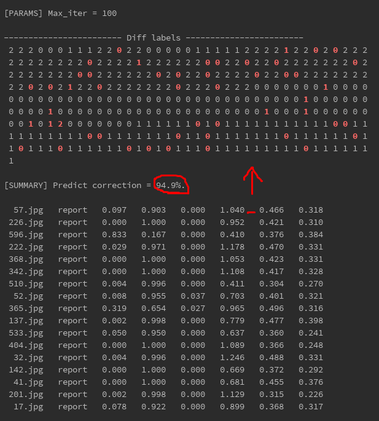


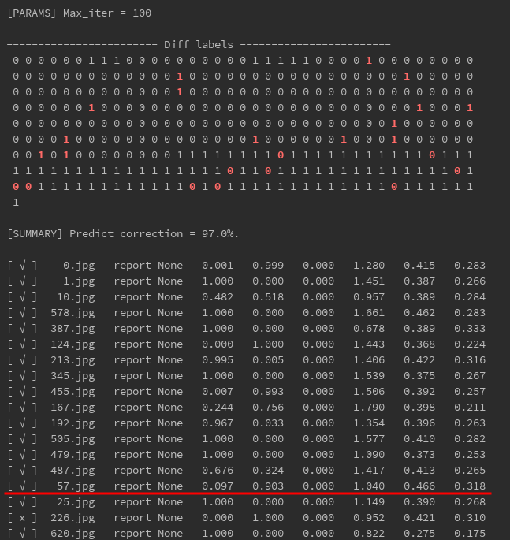

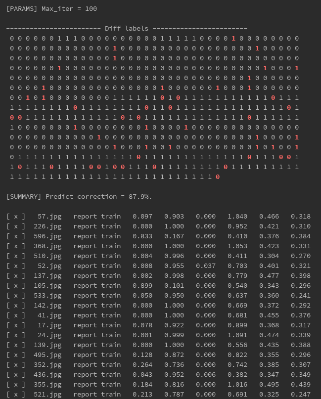


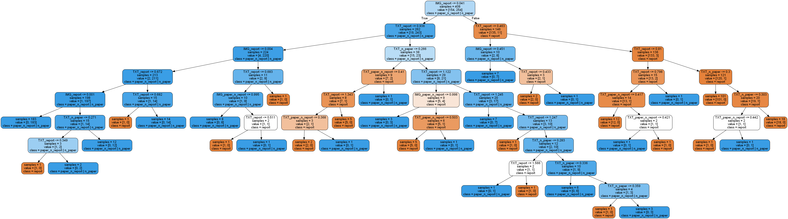


### 2. OCR信息提取

 - 图片水平矫正。
   - 根据 `Baidu OCR` 结果大范围旋转（90度等）。
   - 用 `opencv` 定位两条长线（区域划分周长最长高度最扁）。
   - 端点 X 轴对齐（担心有些图片没把直线拍完整）。
   - 水平还原。
 - 中文分词。
 - 根据打分矩阵注意判断切出来的中文短语和目标短语的近似度。
 - 近似度过低的认为匹配失败。
 - 对于开头缺字的，进行移位矫正。（有点 MSA 的味道？？）
 - 对匹配上的中文分词查找其json文件中的下一项或紧随的字符。
 - 过滤掉非数字的部分，和目标短语对应的值范围比较。
   - 没有找到数字则认为没找到；
   - 超出值范围过多设置警告标记，在前端提醒用户检查；
 - 把结果打包成json格式。


**信息提取**：（关键代码）

```python
from src.img2txt import Img2Txt
import re
import json

""" 通过打分矩阵判断目标文本的相似度 """
def str_similarity(str_test, str_real):
    def get_item(string, loc):
        try:
            return string[loc]
        except IndexError:
            return None
    score = 0
    for i, character in enumerate(str_real):
        if character in str_test:
            caleb_i = str_test.find(character)
        else:
            caleb_i = i
        if get_item(str_test, caleb_i) is None:
            score += 0.5
        elif get_item(str_test, caleb_i) == character:
            score += 1
        else:
            score += 0.5
    score -= abs(len(str_test) - len(str_real)) * 0.2
    score /= len(str_real)
    return score


sorted_term = list(term_dict.keys())
sorted_term.sort(key=lambda x: len(x), reverse=True)

with open('../img/categorize/report/ocr_txt/28.txt') as f:
    content = f.read()
content = eval(content)

""" 分离中文字符 """
chinese_list = []
for index, item in enumerate(content):
    tmp = []
    info = item[0]
    p2 = re.compile(r'[^\u4e00-\u9fa5]')  # 中文的编码范围是：\u4e00到\u9fa5
    zh = p2.split(info)
    while '' in zh:
        zh.remove('')
    for char in zh:
        if char == '红细胞分布宽度':
            term_b = item[0].find(char)
            term_e = term_b + len(char) + 3
            char = item[0][term_b:term_e]
        tmp.append([index, char, item[0].find(char)])
    chinese_list += tmp

""" 目标短语逐一匹配 """
result = []
for term in sorted_term:
    sim_list = []
    for index, item in enumerate(chinese_list):
        if item[1] != '超敏':
            if item[1] == '反应蛋白':
                item[1] = '超敏C反应蛋白'
            similarity = round(str_similarity(item[1], term), 3)
            sim_list.append((similarity, index, item[1], term))

    sim_list.sort(reverse=True)
    similarity = sim_list[0][0]
    if similarity > 0.87:
        item = chinese_list[sim_list[0][1]]
        num_b = item[2] + len(item[1])
        num_e = num_b + 5
        i_dirty = content[item[0]][0][num_b:num_e]
        i_float = clean_float(i_dirty)
        if i_float == '':
            try:
                i_float = float(content[item[0] + 1][0][:4])
            except ValueError:
                try:
                    i_float = float(content[item[0] + 2][0][:4])
                except ValueError:
                    i_float = 'Not found'
        result.append((list(term_dict.keys()).index(term), term, item, i_float))
    else:
        result.append((0, term, '', 'Not found'))


result.sort()
result_dict = {}
for item in result:
    lower, upper = term_dict[item[1]]
    result_dict[item[1]] = item[3]
print(json.dumps(result_dict, indent=4, ensure_ascii=False))
```


**水平矫正：**（关键代码）

```python
import numpy as np
from imutils import perspective
import cv2
import imutils
import os


def wrap(root, fn):
    wrap_path = (root[:-1] if root[-1] == '/' else root) + '/wrapped/'
    if not os.path.exists(wrap_path):
        os.mkdir(wrap_path)

    # 边缘扫描
    image = cv2.imread((root[:-1] if root[-1] == '/' else root)+'/'+fn)
    ratio = image.shape[0] / 500.0  # 比例
    orig = image.copy()
    image = imutils.resize(image, height=500)

    # 灰度转换及边缘查找
    gray = cv2.cvtColor(image, cv2.COLOR_BGR2GRAY)
    gray = cv2.GaussianBlur(gray, (5, 5), 0)
    edged = cv2.Canny(gray, 50, 200)  # 边缘检测

    # 只保留轮廓
    cnts = cv2.findContours(edged.copy(), cv2.RETR_LIST, cv2.CHAIN_APPROX_SIMPLE)  # 通过边缘图像找到轮廓
    cnts = cnts[0] if imutils.is_cv2() else cnts[1]  # 用以区分OpenCV2.4和OpenCV3
    cnts = sorted(cnts, key=lambda x: cv2.arcLength(x, True), reverse=True)[:5]  # 保留最大轮廓

    # 选取上下半图最长线条
    upper_line = [0, 500, 0, 500]
    lower_line = [0, 0, 0, 0]
    for cnt in cnts:
        epsilon = 0.1 * cv2.arcLength(cnt, True)
        approx = cv2.approxPolyDP(cnt, epsilon, True)
        if len(approx) == 2:
            x1, y1, x2, y2 = approx.flat
            if abs(y1 - y2) < image.shape[0] * 0.1:
                if min(y1, y2) > 250:
                    if abs(x1 - x2) > abs(upper_line[0] - upper_line[2]):
                        upper_line = [x1, y1, x2, y2]
                if max(y1, y2) < 250:
                    if abs(x1 - x2) > abs(lower_line[0] - lower_line[2]):
                        lower_line = [x1, y1, x2, y2]

    def adjust_endpoint(l1, l2):
        def x_order(l):
            if l[0] > l[2]:
                l = [l[2], l[3], l[0], l[1]]
            return l
        l1, l2 = x_order(l1), x_order(l2)
        slope_1 = (l1[3] - l1[1]) / (l1[2] - l1[0])
        slope_2 = (l2[3] - l2[1]) / (l2[2] - l2[0])
        if l1[0] < l2[0]:
            l1[0], l1[1] = l2[0], int((l2[0] - l1[0]) * slope_1 + l1[1])
        else:
            l2[0], l2[1] = l1[0], int((l1[0] - l2[0]) * slope_2 + l2[1])
        if l1[2] > l2[2]:
            l1[2], l1[3] = l2[2], int((l1[2] - l2[2]) * slope_1 + l1[3])
        else:
            l2[2], l2[3] = l1[2], int((l2[2] - l1[2]) * slope_2 + l2[3])
        return l1, l2

    try:
        upper_line, lower_line = adjust_endpoint(upper_line, lower_line)
    except ZeroDivisionError:
        cv2.imwrite(wrap_path + fn, orig)
        return 'Warp fail'

    screenCnt = np.array(upper_line+lower_line).reshape(4, 2)

    # 透视矫正
    warped = perspective.four_point_transform(orig, screenCnt.reshape(4, 2) * ratio)
    cv2.imwrite(wrap_path+fn, warped)
    return 0
```


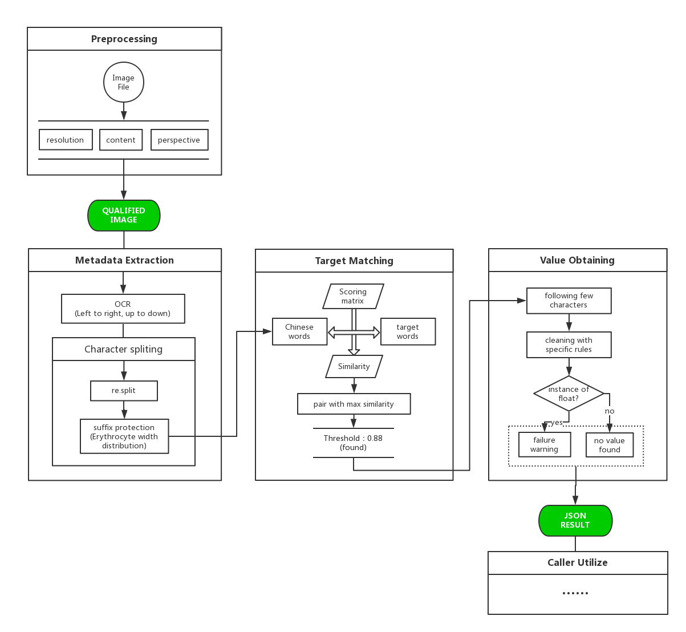

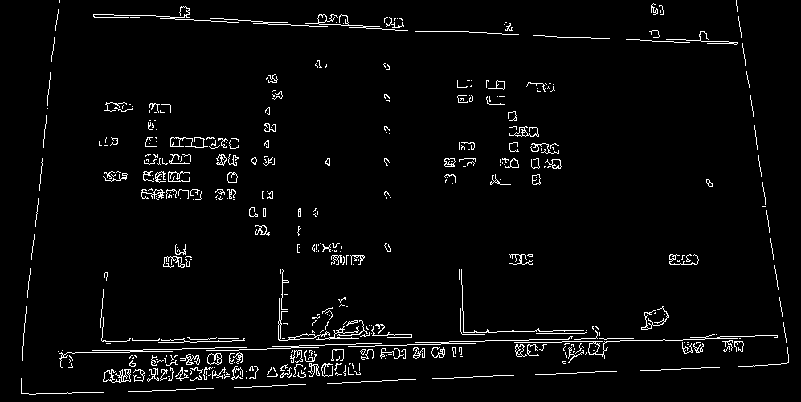


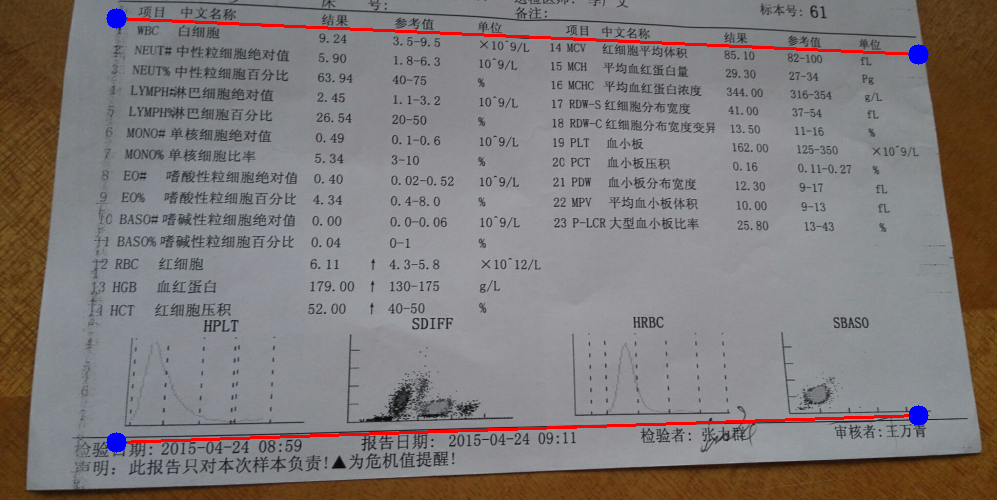


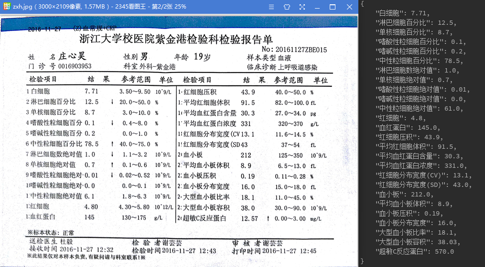


### 3. 语义化和可视化

 - 逻辑梳理。
 - 视觉稿设计。
 - 注：此处应该用机器学习的方法来实现语义化会更棒，但是缺少大量标记数据集。


### 4. PDF 生成

 - 使用 `Report Lab` 库。
 - 文字图片分层绑定渲染。
 - 自适应布局。
 - 全局统一坐标系统，扩展支持页面顶端基线。
 - 全局色彩管理系统。配色方案管理，基于配色方案的渐变梯度生成。
 - 渐变积木图片生成。因为 pdf 中显示效果不佳弃用。

**pdf生成：**（关键代码）

```python
from reportlab.pdfgen.canvas import Canvas
from reportlab.platypus import Table, TableStyle, Paragraph
from reportlab.lib import colors
from reportlab.lib.units import inch, cm, mm
from reportlab.pdfbase import pdfmetrics
from reportlab.pdfbase.ttfonts import TTFont
from reportlab.lib.enums import TA_LEFT, TA_CENTER, TA_RIGHT
from reportlab.lib.styles import ParagraphStyle
from src.pdf_gen.src.backend_data_hub import Db2Pdf, BackendApiDev
from math import log


class DrawElement:

    def __init__(self, file_name, title, summary, result_text, levels,
                 img_dir='../assets/img/', font_dir='../assets/font/'):
        self.canvas = Canvas(file_name, pagesize=PAGE_SIZE)
        self.levels = levels
        self.title = title
        self.summary = summary
        self.result_text = result_text
        self.col_num = len(levels['values'])
        self.terms = ['\n'.join(list(x)) for x in levels['terms']]
        self.img_dir = img_dir
        self.font_dir = font_dir
        self.table_colors = {
            'background': [],
            'text': []
        }
        self.fill_color()
        self.register_font()

    def register_font(self):
        # 注册字体

    """ 封装画整段文字的功能 """
    def paragraph(self, txt, padding_top, li, ri, color, font_size=5.7, font_name='PingFang-Regular', alignment=0):
        rr, gg, bb = color
        style = ParagraphStyle(
            name='Normal',
            fontName=font_name,
            textColor=colors.Color(rr, gg, bb),
            leading=9,
            fontSize=font_size,
            alignment=alignment
        )
        p = Paragraph(txt, style)
        p.wrapOn(self.canvas, ILLU_WIDTH - li - ri, 120)
        w, h = p.wrap(ILLU_WIDTH - li - ri, 120)
        p.drawOn(self.canvas, ILLU_X + li, up_2_down_axis(padding_top, h))

    def text_on_pdf(self):
        # 各种文字

    """ 画表格 """
    def table_text(self, data):
        row_height = ROW_HEIGHT.copy()
        row_height.reverse()
        row_height = [.9] + [row_height[0]] + [row_height[1] * 0.95] + [row_height[2] * 10.3] + [row_height[-1]]
        row_height = [x * (COL_WIDTH - TABLE_PADDING * 0.5) for x in row_height]

        t = Table(data, colWidths=COL_WIDTH * TABLE_SCALAR * 1.012, rowHeights=row_height)
        r, g, b = sc['DB']
        style_list = [
            ('FONT', (0, 0), (-1, 0), 'AvenirNext-DemiBold', 10.8),  # Top values
            ('FONT', (0, 2), (-1, 2), 'PingFang-Medium', 7),  # Text line
            ('TEXTCOLOR', (0, 2), (-1, 2), colors.Color(r, g, b)),
            ('FONT', (0, -1), (-1, -1), 'AvenirNext-DemiBold', 7.4),  # Bottom values
            # ('GRID', (0, 0), (-1, -1), 0.5, colors.black),
            ('VALIGN', (0, 0), (-1, -1), 'MIDDLE'),
            ('ALIGN', (0, 0), (-1, 2), 'CENTER'),
            ('ALIGN', (0, -1), (-1, -1), 'RIGHT')
        ]
        for i_col, column in enumerate(self.table_colors['text']):
            for i_line in range(3):
                r, g, b = column[i_line]
                style_list.append(('TEXTCOLOR', (i_col, i_line * 2), (i_col, i_line * 2), colors.Color(r, g, b)))
        t.setStyle(TableStyle(style_list))
        t.alignment = TA_CENTER
        t.wrapOn(self.canvas, 3 * inch, 3 * inch)
        t.drawOn(self.canvas, TABLE_LEFT - TABLE_PADDING * TABLE_SCALAR / 2, PADDING_BOTTOM - 1.5)

    def table(self):
        # 表格数据准备

    """ 表格背景的绘制 """
    def table_bg(self):
        # c.radialGradient(105 * mm, 200 * mm, 60 * mm, (red, yellow), extend=False)
        block_width = COL_WIDTH
        padding = TABLE_PADDING
        scalar = TABLE_SCALAR
        y_height = ROW_HEIGHT
        y_pos = []
        h_total = 0
        for i_h, h in enumerate(y_height):
            y_pos.append((h_total, int(h * (block_width - padding))))
            if i_h == 0 or i_h == 10 or i_h == 11:
                h_total += padding * 0.3
            h_total += int(h * (block_width - padding)) + padding

        range_end = int(block_width * scalar * 18)
        step = int(block_width * scalar) + 1
        res_colors = self.table_colors['background']

        for ix, x in enumerate(range(0, range_end, step)):
            for iy, (y, height) in enumerate(y_pos):
                r, g, b = res_colors[ix][12 - iy]
                self.canvas.setFillColor(colors.Color(r, g, b))
                self.canvas.roundRect(TABLE_LEFT + x, PADDING_BOTTOM + y, (block_width - padding) * scalar,
                                      height, 2, stroke=0, fill=1)

    def finish(self):
        self.canvas.save()
```


**色彩管理系统：**（关键代码）

```python
class ColorScheme:
    
    standard_colors = {
        'DO': (255, 111, 2),
        'MO': (254, 195, 120),
        'LO': (255, 223, 202),
        'DB': (30, 169, 254),
        'LB': (199, 234, 254)
    }
    sc = {key: tuple((x + 1) / 256 for x in value) for key, value in standard_colors.items()}

    """ 前景背景色管理 """
    def front_color(self, back_color):
        if back_color == ColorScheme.sc['DO']:
            return tuple([1, 1, 1])
        elif back_color == ColorScheme.sc['LB']:
            return ColorScheme.sc['DB']
        elif back_color == ColorScheme.sc['LO']:
            return ColorScheme.sc['DO']
        pass

    def fill_color(self):
        def top_bar():
            if res < 0:
                c = ColorScheme.sc['DO']
            else:
                c = ColorScheme.sc['LB']
            return c

        """ 渐变色管理 """
        def gradient():
            if res == -1:
                c = self.get_color(ColorScheme.sc['LO'], ColorScheme.sc['MO'], 5) + \
                    self.get_color(ColorScheme.sc['MO'], ColorScheme.sc['DO'], 6)[1:]
            elif res == -2:
                c = self.get_color(ColorScheme.sc['DO'], ColorScheme.sc['MO'], 6)[:-1] + \
                    self.get_color(ColorScheme.sc['MO'], ColorScheme.sc['LO'], 5)
            else:
                c = [ColorScheme.sc['LB'] for _ in range(10)]
                c[res] = ColorScheme.sc['DB']
                if res > 0:
                    c[res - 1] = self.get_color(ColorScheme.sc['LB'], 
                                                ColorScheme.sc['DB'], 3)[1]
                if res < 9:
                    c[res + 1] = self.get_color(ColorScheme.sc['LB'], 
                                                ColorScheme.sc['DB'], 3)[1]
            return c

        def top_value():
            if res < 0:
                c = ColorScheme.sc['DO']
            else:
                c = ColorScheme.sc['DB']
            return c

        block_colors = []
        text_color = []
        for res in self.levels['scales']:
            term_bg, term_text = term_bar()
            range_bg, range_text = range_bar()
            block_colors.append([top_bar(), term_bg] + gradient() + [range_bg])
            text_color.append([top_value(), term_text, range_text])
        self.table_colors['background'] = block_colors
        self.table_colors['text'] = text_color
```


### 5. 网页应用数据库

 - 数据／规则分离。
 - 规则更新时间管理。
 - 同时包含基础信息和指标规则。
 - 注：指标规则应该随着基本信息变化。
 - 注：有个操作性强的规则管理后台就好了。


**pdf 数据接口：**（关键代码）

```python
from pymongo import MongoClient
import datetime

class Db2Pdf:
    def __init__(self):
        client = MongoClient('localhost', 27017)
        self.col_num = 18
        self.db = client.health_care
        self.levels = None
        self.standards = list(self.db.blood_STD.find())
        self.records = list(self.db.blood_DATA.find())[8]
        self.construct_levels()
        self.data_length_check()

    def data_length_check(self):
        if len(self.levels.values) != self.col_num:
            print("Column number don't match!")
        for content in ['terms', 'values', 'ranges', 'scales']:
            self.levels.__setattr__(content, self.levels.__getattr__(content)[:18])

    def construct_levels(self):
        rl = RecordLevel()
        rl.terms = list(self.records.keys())[1:]
        rl.values = list(self.records.values())[1:]
        rl.ranges = [tuple(x['range']) for x in self.standards]
        rl.scales = self.scale_generator()
        self.levels = rl

    def scale_generator(self):
        std_dict = {}
        for std in self.standards:
            std_dict[std['term']] = std

        scale_list = []
        for term, value in self.records.items():
            if term == '_id':
                continue
            mmin, mmax = std_dict[term]['range']
            if value < mmin:
                scale_list.append(-1)
            elif value > mmax:
                scale_list.append(-2)
            else:
                scale_list.append(int((value - mmin) // ((mmax - mmin) / 10)))

        return scale_list
```


### 6. 前端开发

 - 使用 `Angular 2+` 框架，安利一下 `Type Script`。
 - 使用蚂蚁金服 `Ant Design` 组件库。
 - 对于超出页面的部分采用自定义样式的混动条（`malihu-scrollbar`）以匹配UI。
 - 同时支持上传照片和手动填写信息。
 - pdf 显示对页面自适应（`pdf-viewer`）。
 - 增加项目 logo。


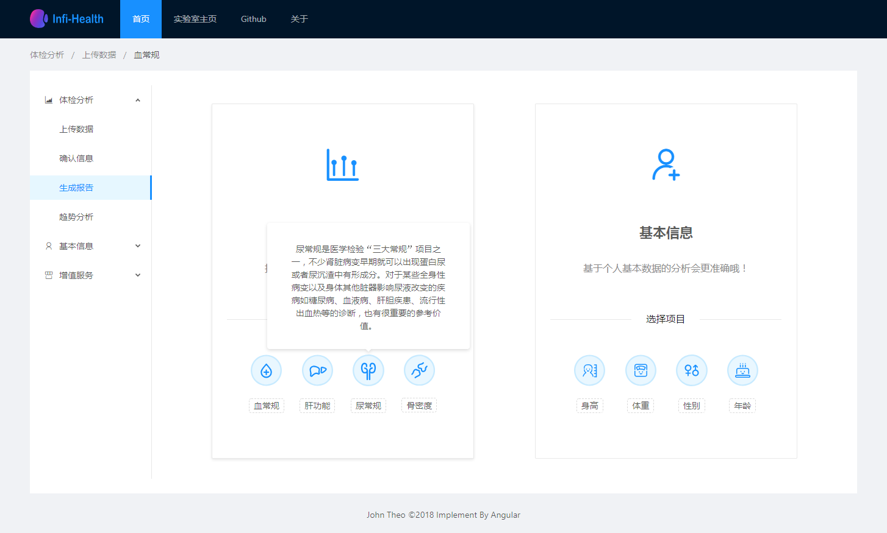

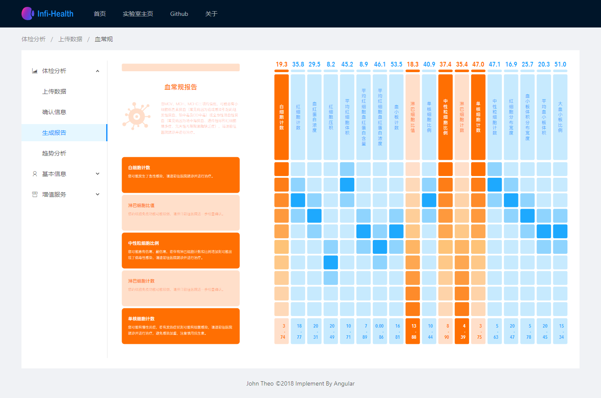

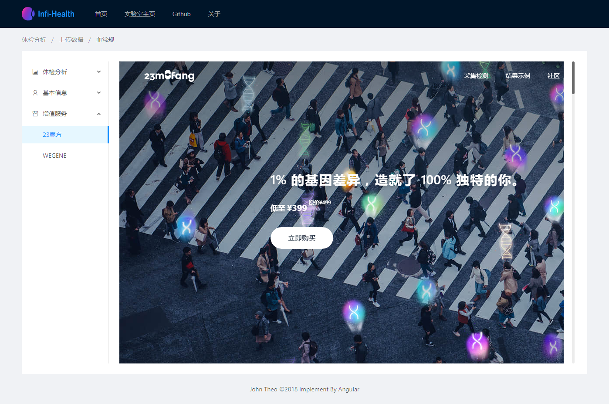


## 四、代码规模

### 1. 功能开发部分


### 2. GUI部分


## 五、未来工作

 - 后端和服务。
 - 大同数据库和 后段-python整合。
 - 完善指标推断规则管理。
   - 运用机器学习。
   - 可视化在线管理后台，可以添加、删除规则。
   - 规则应该和基本信息绑定。
 - 生产环境部署


## 六、特别感谢

陈铭老师一个学期的指导和鼓励，两位助教学长的耐心答疑和讨论。你们是我坚持这个项目的最大动力！


---

> 庄心昊
> 2018.06.24
