# 体检报告单自动分析系统

本项目期望通过用户上传的体检报告单，结合用户的自身状况，语义化地将报告结果呈现给用户。

## 功能需求概览

| 需求               | 是否与机器学习相关 | 方案替代     | 优先级 |
| ------------------ | ------------------ | ------------ | ------ |
| 用户上传图片并OCR  | 是                 | /            | 高     |
| 用户图片合法性验证 | 是                 | /            | 低     |
| OCR结果信息提取    | 否                 | 用户手动填写 | 中     |
| 数据转语义         | 是                 | 基于既定规则 | 中     |
| 数据可视化         | 否                 | /            | 高     |
| PDF生成            | 否                 | /            | 高     |
| 数据沉淀和跟踪     | 否                 | /            | 中     |

## 项目技术选型

- **GUI。**基于 `Angular 2+`，采用 `Ant Design` 组件库。

- **后端、服务。**基于 `Node.js`、`Express`，需要进行复杂操作的步骤（如生成PDF等）均调用 `Python` 脚本实现。

- **数据库。**网页应用数据库采用 `MongoDB`，训练结果存储采用 `Sqlite3`。

- **OCR。**使用 `Baidu OCR API`。使用含位置信息的文本识别，预期位置信息能帮助信息提取，但是发现因为识别结果非常混乱，实现难度相当之大。

- **OCR信息提取。**`OpenCV` 区域划分，基于自定义打分矩阵的文本模糊匹配。

- **PDF生成。**使用 `Report Lab`。图片和文字分层渲染，图片自适应布局，全局统一坐标系。

- **图片合法性验证。** 图像和文字两种分类器的整合。图像分类器采用 `TensorFlow for Poets` 迁移学习，文字分类器采用朴素贝叶斯，模型集合采用决策树（对两个分类器六个概率值）。

## 项目经历

### 用户图片合法性验证

本模块通过决策树对图形分类器和文字分类器的6个概率值进行学习，判断用户上传的图片是否是体检单照片（并没有什么用，拿来入门练个手TAT）。

#### 数据采集与清洗

- 采用爬虫下载了众多“体检单”等关键词的图片。
- 增加尺寸过滤器。
- 因为图片重复较多，增加“isDownloaded”过滤器。
- 开启多进程。因为进程异常挂起放弃多线程。
- 使用百度OCR SDK获得结果，并绘制到原图上检验。
- 人工分类（体检报告单，纸张但不是体检报告单，不是纸张）并删除无关数据。

#### 图形分类器

 - TensorFlow for Poets 迁移学习。
 - 正确率 90.1 %（但是数据集太小了）。

#### 文字分类器

 - 使用 `collections.Counter` 进行字频统计，发现效果并不良好。
 - 统计并过滤了没有类别特异性的词汇（如“1”，“的”）。
 - 模型对于“报告”和“非纸质材料”两类判别正确率90%左右，但对于“纸质但不是报告”的分类经常容易判别成“报告”。（事实上，我在“纸质但不是报告”类别中，放的大多数图片都是宣传体检的小广告，里面也有很多体检类目的术语）
 
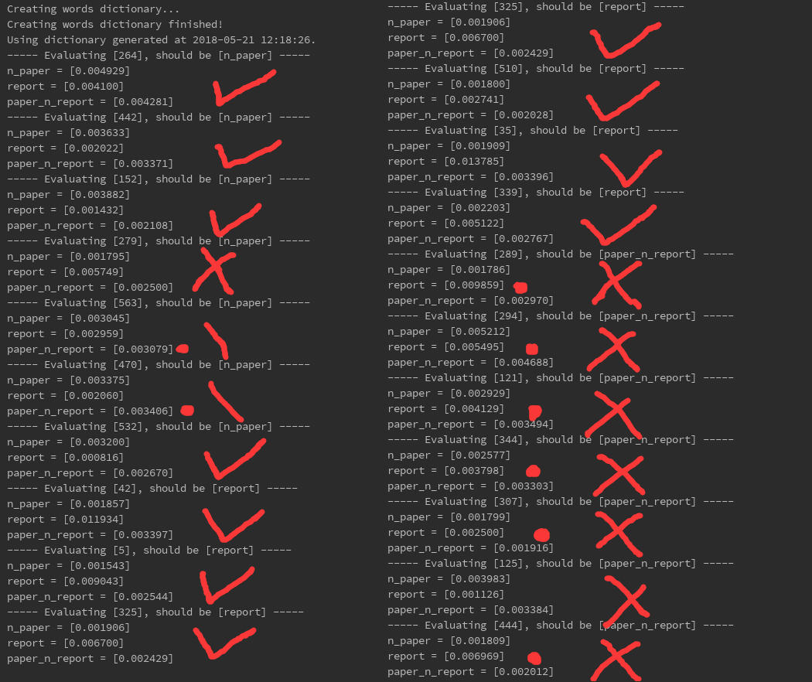

#### 模型整合
 - 数据准备。
   - 降低图片分辨率喂给训练好的图像分类器，获得三类概率。
   - 原图上传 Baidu OCR，获得文字识别json文件。
   - 将json文件中的文字分离，喂给训练好的文字分类器，获得三类概率。
 - 将两个分类器的各3个预测概率写入 `sqlite3` 数据库中。
 - 尝试 K Means 聚类
   - 100轮迭代内聚类中心已经稳定，增加轮数结果完全相同。
   - 图像分类器和文字分类器具有很好的互补作用（典型的决策树问题）。
   - 一些文字分类器前两类结果太相近时不具有参考价值：增加新 feature，做差做商，结果发现单独做差效果更好。
   - 聚成2类（K=2）（实际问题中我不关注“纸张但不是报告”和“不是报告”的区别），效果进一步提升。
   - 至此正确率达到 87.9%（训练集上）。
 - 尝试决策树
   - 使用 scikit-learn 的 tree。
   - 自动训练和cross validation。训练集 99.8% 以上，测试集 89% 以上正确率。
   - 随机抽取100张图片测试，TP:FP:TN:FN = 38:0:61:1，理论正确率98%。
 
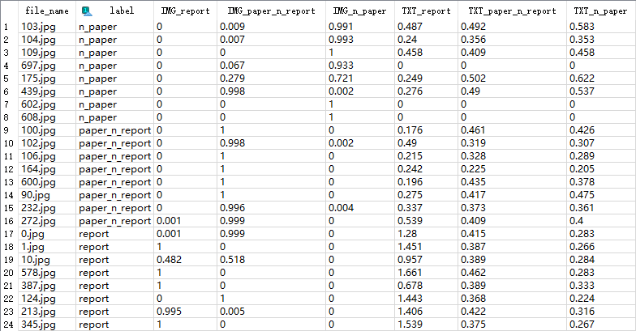

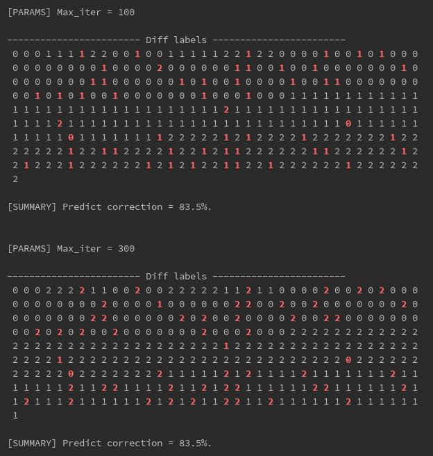

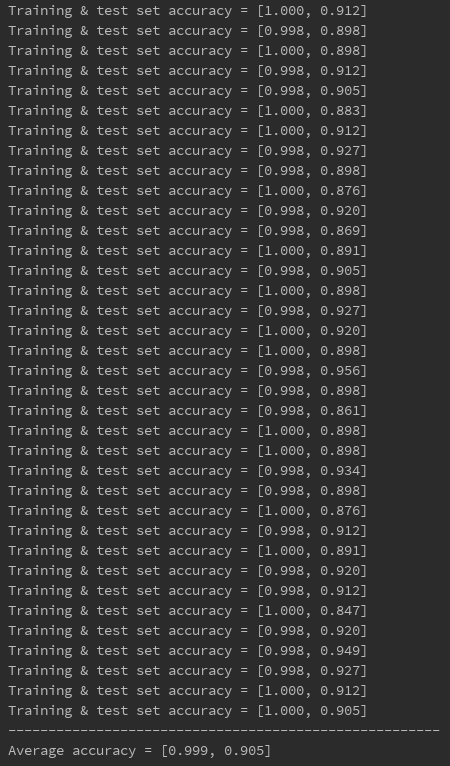

### OCR信息提取

 - 图片水平矫正。
   - 根据 `Baidu OCR` 结果大范围旋转（90度等）。
   - 用 `opencv` 定位两条长线（区域划分周长最长高度最扁）。
   - 端点 X 轴对齐（担心有些图片没把直线拍完整）。
   - 水平还原。
 - 中文分词。
 - 根据打分矩阵注意判断切出来的中文短语和目标短语的近似度。
 - 近似度过低的认为匹配失败。
 - 对于开头缺字的，进行移位矫正。（有点 MSA 的味道？？）
 - 对匹配上的中文分词查找其json文件中的下一项或紧随的字符。
 - 过滤掉非数字的部分，和目标短语对应的值范围比较。
   - 没有找到数字则认为没找到；
   - 超出值范围过多设置警告标记，在前端提醒用户检查；
 - 把结果打包成json格式。

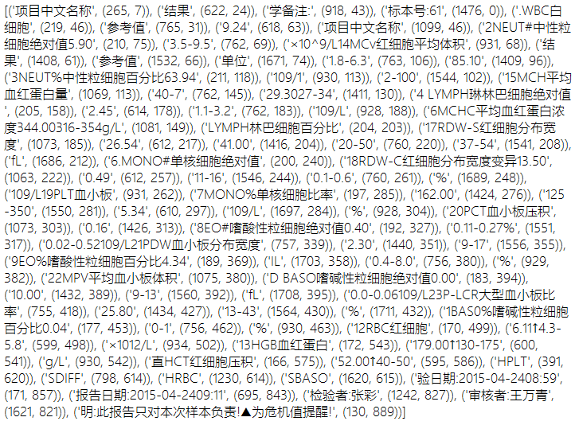

### 语义化和可视化

 - 逻辑梳理。
 - 视觉稿设计。
 - 注：此处应该用机器学习的方法来实现语义化会更棒，但是缺少大量标记数据集。
 
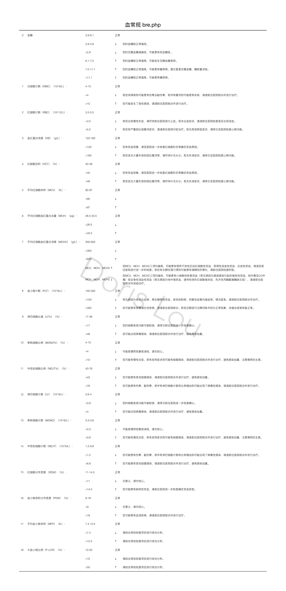

### PDF 生成

 - 使用 `Report Lab` 库。
 - 文字图片分层绑定渲染。
 - 自适应布局。
 - 全局统一坐标系统，扩展支持页面顶端基线。
 - 全局色彩管理系统。配色方案管理，基于配色方案的渐变梯度生成。
 - 渐变积木图片生成。因为 pdf 中显示效果不佳弃用。

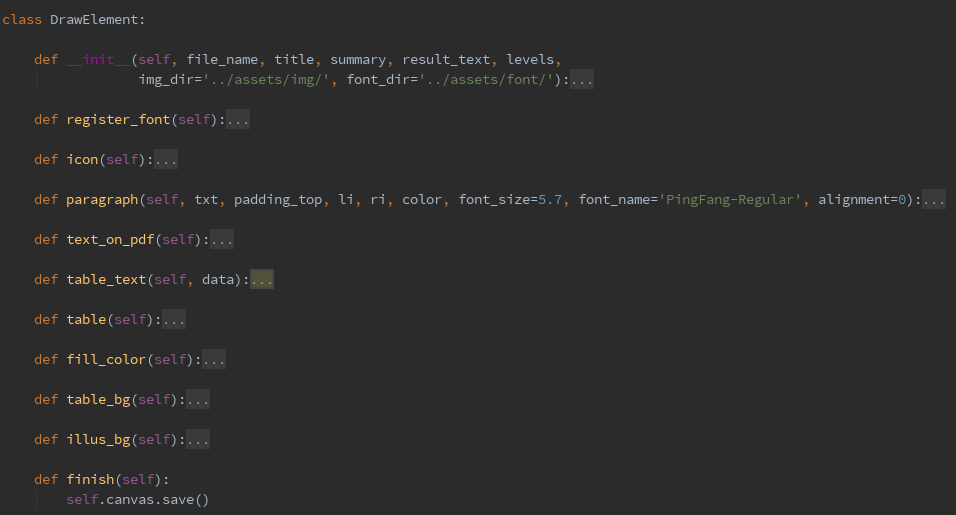
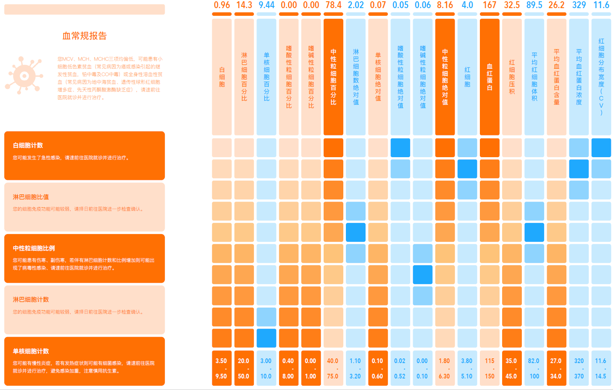

### 网页应用数据库

 - 数据／规则分离。
 - 规则更新时间管理。
 - 同时包含基础信息和指标规则。
 - 注：指标规则应该随着基本信息变化。
 - 注：有个操作性强的规则管理后台就好了。

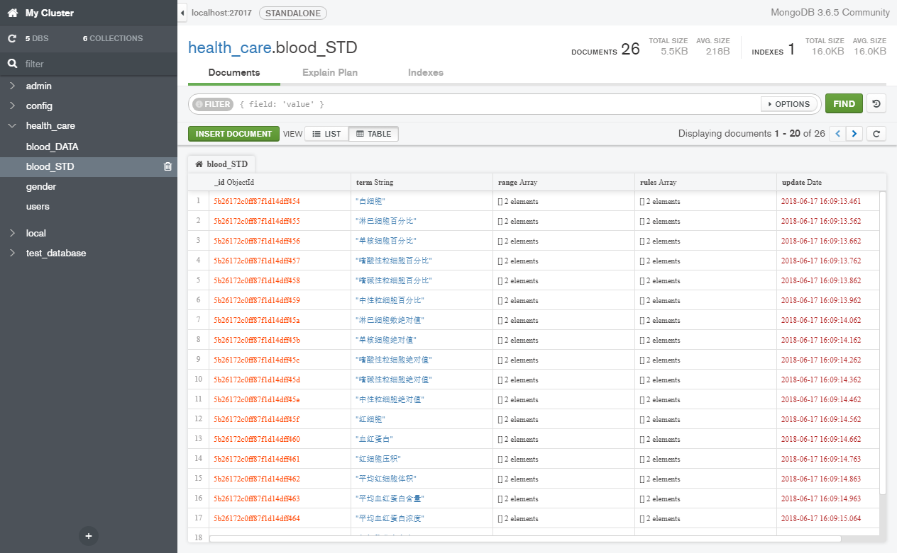

### 前端开发

 - 使用 `Angular 2+` 框架，安利一下 `Type Script`。
 - 使用蚂蚁金服 `Ant Design` 组件库。
 - 对于超出页面的部分采用自定义样式的混动条（`malihu-scrollbar`）以匹配UI。
 - 同时支持上传照片和手动填写信息。
 - pdf 显示对页面自适应（`pdf-viewer`）。
 - 增加项目 logo。

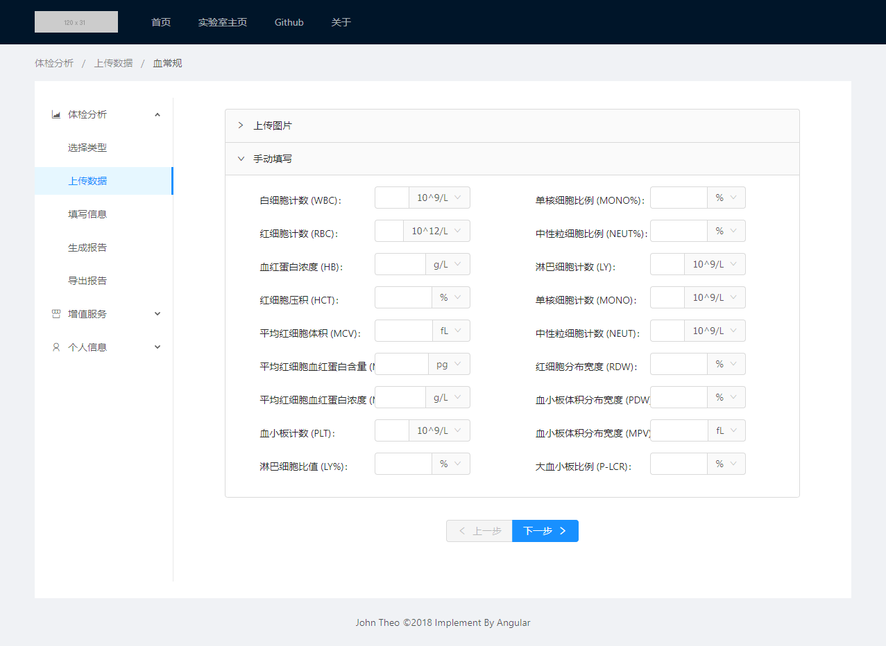

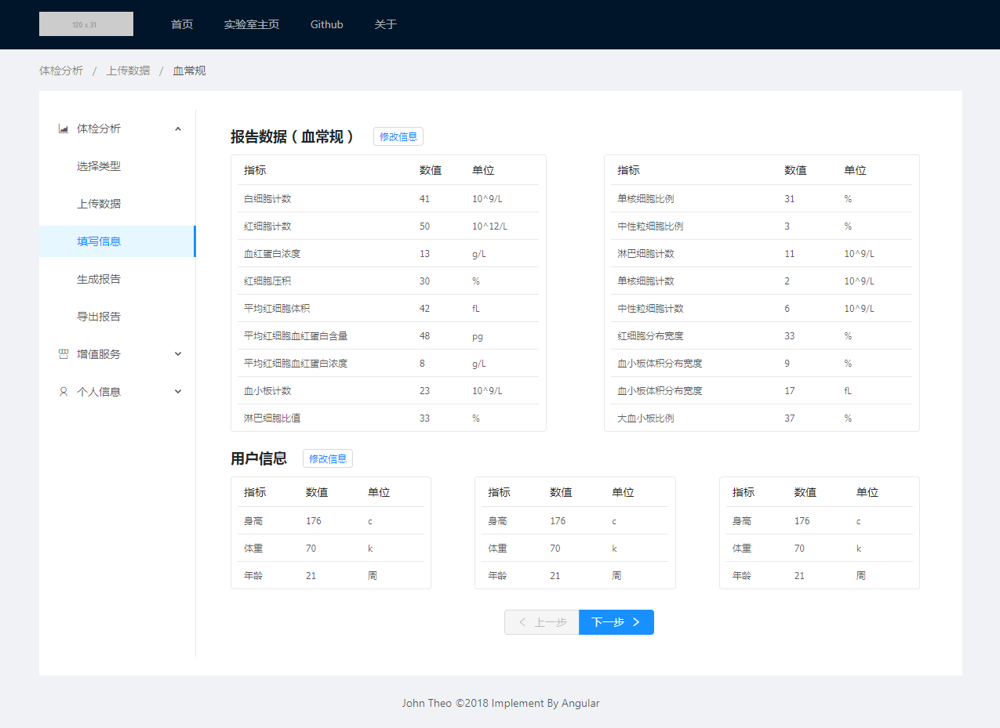

## 未来工作

 - 后段和服务。
 - 大同数据库和 后段-python整合。
 - 完善指标推断规则管理。
   - 运用机器学习。
   - 可视化在线管理后台，可以添加、删除规则。
   - 规则应该和基本信息绑定。
 - 生产环境部署

---

> 庄心昊
> 2018.06.24
